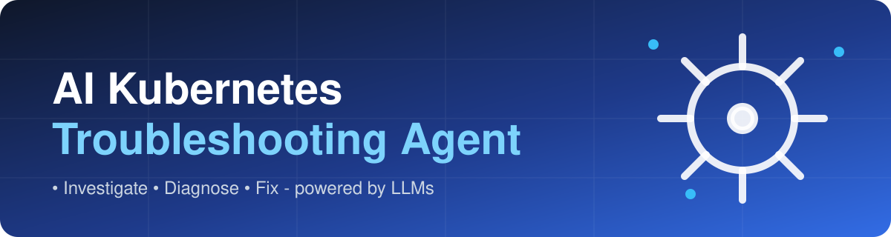

<div align="center">



# 🤖☸️ AI Kubernetes Troubleshooting Agent

**Click "Investigate", get the root cause and the fix.**
A self-hosted agent that collects read-only evidence from your cluster and asks an LLM to explain what is broken and how to fix it.


[](https://github.com/Jdilsham/AI-Kubernetes-Agent/actions/workflows/ci.yml)
[](https://github.com/Jdilsham/AI-Kubernetes-Agent/releases)

</div>

## ✨ What it does

1. **Collects evidence** with read-only `kubectl` calls: pods, logs, events, deployments, services, nodes and 20+ other resource types.
2. **Filters noise**: drops stale events, redacts passwords and tokens, never reads Secret values.
3. **Asks an LLM** (any OpenAI-compatible API) to correlate the evidence like a senior SRE.
4. **Shows every issue** with severity, affected resources, root cause, a numbered fix, copy-paste `kubectl` commands, prevention and a confidence score.

Everything runs **inside your cluster**. There is no external account, no SaaS and no database to set up: you only bring an LLM API key.

## 🚀 Quick start

```bash
helm install k8s-agent oci://ghcr.io/jdilsham/charts/ai-k8s-agent --version 0.1.0 \
  --namespace k8s-agent --create-namespace \
  --set llm.apiKey=$OPENROUTER_API_KEY \
  --set llm.model=nvidia/nemotron-3-super-120b-a12b:free  # any model your llm.baseUrl provider offers; this one is free on OpenRouter

# open the UI
kubectl port-forward -n k8s-agent svc/k8s-agent-ai-k8s-agent 8080:80
# admin password (generated at install)
kubectl get secret -n k8s-agent k8s-agent-ai-k8s-agent -o jsonpath='{.data.admin-password}' | base64 -d; echo
```

Browse to http://localhost:8080, sign in, pick a namespace (or all) and click the wheel.

Upgrade with `helm upgrade k8s-agent oci://ghcr.io/jdilsham/charts/ai-k8s-agent --version <new> -n k8s-agent --reuse-values`.
To install from a clone instead, use `./charts/ai-k8s-agent` as the chart.

Requirements: Kubernetes (tested on 1.35), Helm 3, a default StorageClass (or `--set persistence.enabled=false`), and an API key for an OpenAI-compatible LLM.

> **First install can be slow.** Nodes download the backend image (~250 MB) on first start. On slow links this takes several minutes;
> if you use `--wait`, give it room with `--timeout 10m`, otherwise Helm reports a failure while the pod is still pulling.
> Check progress with `kubectl get pods -n k8s-agent -w`.

## 🔍 What it detects

| Area | Examples |
|---|---|
| Pods | CrashLoopBackOff, ImagePullBackOff, OOMKilled, Pending, not ready (probe failures), stale pods, failed init containers |
| Workloads | Deployments not available, stuck rollouts, StatefulSets/DaemonSets not ready, failed Jobs, suspended/failing CronJobs, HPAs that cannot scale |
| Networking | Service selector mismatch, no endpoints, CoreDNS down, Ingress backend/port/TLS problems, LoadBalancers without an IP, default-deny NetworkPolicies |
| Storage | PVCs pending, missing StorageClass, failed PVs, missing ConfigMaps/Secrets referenced by pods |
| Capacity | Node not ready or under pressure, pod density near max, high CPU/memory, ResourceQuotas nearly exhausted, PDBs blocking drains |
| Security & platform | RBAC "forbidden" errors, registry auth failures, expiring TLS certificates, cert-manager, failed Helm releases, unhealthy cluster add-ons |

Common fixes are built from real cluster data instead of the LLM's guess: wrong image tags become one in-place `kubectl set image`, selector mismatches get the exact patch, and destructive deletes (Services, PVCs, namespaces, ...) are never suggested.

## 🧠 How an investigation works

```text
kubectl evidence ──▶ prompt builder ──▶ LLM ──▶ JSON diagnosis ──▶ safety checks ──▶ UI
```

1. **Evidence (no AI).** The backend runs read-only `kubectl` calls in steps (pods, logs, events, deployments, networking,
   other resources) and reports each step live. If nothing is unhealthy, it answers "Cluster appears healthy" without calling the LLM.
2. **Prompt.** Each failing pod is grouped with its own logs, events, spec and sibling pods; other findings follow. Secrets in
   commands and logs are masked, stale events are dropped, and the evidence is capped at 30,000 characters. The system prompt asks
   the model to act as a senior SRE, report every distinct issue, use only real resource names and answer in a fixed JSON format.
3. **LLM call.** One `POST {llm.baseUrl}/chat/completions` (temperature 0, JSON mode, 120 s timeout, retries on 429/5xx/timeouts).
   If the answer contains no issues, it asks once more.
4. **Safety checks (code, not AI).** The answer is corrected where models are unreliable:
   - image pull failures get a single in-place `kubectl set image` built from the real container and owner
   - Service selector mismatches get a selector patch computed from the actual pod labels
   - deletes of Services, Deployments, PVCs, Secrets, namespaces or nodes are removed
   - issues without commands get verified hints built from real resource names
5. **Result.** Issues are sorted critical first, stored, and streamed to the browser.

The model never touches the cluster: it only reads the evidence text and writes suggestions. Answer quality depends on the model;
free models work but are slower (about a minute per investigation) and less precise than larger ones.

## 🏗️ Architecture

```text
Browser ──▶ frontend (nginx + React) ──/api──▶ backend (FastAPI)
                                                  │
                    read-only ServiceAccount ◀────┤── kubectl: evidence collection
                    SQLite on a PVC          ◀────┤── investigation history
                    LLM (OpenAI-compatible)  ◀────┘── diagnosis (redacted evidence only)
```

- Investigations run in the background; progress streams to the browser over Server-Sent Events, and a page refresh re-attaches to a running investigation.
- One admin password protects the UI (`auth.mode=none` if you put your own SSO in front).

### Where data is stored

There is no database server. History lives in a **SQLite file** (`/data/agent.db`) inside the backend pod, on a
**PersistentVolumeClaim** (`<release>-ai-k8s-agent-data`), so it survives restarts and `helm upgrade`.

- One row per investigation: status, progress, cluster, namespace scope, root cause, confidence, full diagnosis (JSON), error, time.
- The backend runs as a single replica (`Recreate` strategy) so only one process writes the file.
- The PVC is kept on `helm uninstall`; delete it yourself with `kubectl delete pvc -n k8s-agent <release>-ai-k8s-agent-data`.
- Backup: `kubectl cp k8s-agent/<backend-pod>:/data/agent.db ./agent-backup.db`.
- With `persistence.enabled=false` the file is on an `emptyDir` and history is lost when the pod restarts.

## ⚙️ Configuration

| Value | Default | Description |
|---|---|---|
| `llm.apiKey` / `llm.existingSecret` | `""` | LLM API key (or a Secret with key `llm-api-key`) |
| `llm.model` | `""` | Model name, e.g. `nvidia/nemotron-3-super-120b-a12b:free` |
| `llm.baseUrl` | OpenRouter | Any OpenAI-compatible endpoint: OpenAI, Gemini, Ollama, vLLM, ... |
| `auth.mode` | `password` | `password` or `none` |
| `auth.adminPassword` | random | Set your own, or read the generated one from the Secret |
| `rbac.scope` | `cluster` | `cluster` (all namespaces) or `namespace` (only the release namespace) |
| `rbac.readSecrets` | `false` | Allow listing Secrets to check TLS expiry, missing secrets and Helm releases |
| `persistence.enabled` / `size` | `true` / `1Gi` | SQLite history volume |
| `ingress.enabled` | `false` | Expose the UI through an Ingress |

See [`charts/ai-k8s-agent/values.yaml`](charts/ai-k8s-agent/values.yaml) for everything else.

## 🔒 Security and data

- **Read-only.** The ClusterRole only has `get`, `list` and `watch`. The agent cannot change your cluster; it only *suggests* commands.
- **No Secret values.** Secret access is off by default; even when enabled, only names, labels and public TLS certificates are read.
- **What goes to the LLM:** pod status, a few redacted log lines, events and resource specs. Passwords, tokens and keys in commands and logs are masked first. For fully private use, point `llm.baseUrl` at a local model (e.g. Ollama).
- **Hardened pods:** non-root, read-only root filesystem, all capabilities dropped, no public exposure by default.

## ⚠️ Known limitations

- Tested on a kubeadm cluster (Kubernetes 1.35) with an NFS StorageClass. AKS, EKS, GKE, kind/k3s and arm64 nodes are not tested yet.
- Single backend replica (SQLite). Fine for a team tool, not for high availability.
- On NFS volumes SQLite works because only one pod uses the file, but a local-disk StorageClass is safer.
- Diagnoses are suggestions from an LLM: review commands before running them.

## 🧪 Try it with broken workloads

[`k8s-test/`](k8s-test/) contains intentionally broken workloads (bad image tag, missing env var, OOM, selector mismatch, missing ConfigMap, failing Job, ...). Apply them to a **test** cluster, investigate, then clean up:

```bash
./k8s-test/apply.sh
./k8s-test/cleanup.sh
```

## 🛠️ Local development

```bash
cp backend/.env.example backend/.env   # set OPENROUTER_API_KEY, OPENROUTER_MODEL, ADMIN_PASSWORD
docker compose up --build              # uses your ~/.kube/config
# UI: http://localhost:3000
```

Without Docker: `cd backend && uvicorn app.main:app --port 9000` and `cd frontend && npm run dev` (Vite proxies `/api` to port 9000).

Checks (the same ones CI runs):

```bash
cd backend && pip install -r requirements.txt -r requirements-dev.txt && ruff check . && pytest -q
cd frontend && npm ci && npm run build
helm lint charts/ai-k8s-agent
```

## 📦 Project layout

```text
backend/    FastAPI app: evidence collection (app/kubernetes), LLM diagnosis (app/ai), API, SQLite history; tests/
frontend/   React + Vite + Tailwind UI, served by nginx which proxies /api to the backend
charts/     Helm chart (ai-k8s-agent)
k8s-test/   intentionally broken workloads for testing
.github/    CI (lint, tests, build, chart lint) and release workflows
```
